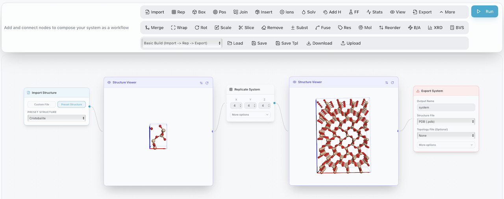

# atomipy web module

A powerful, node-based visual programming environment for designing, manipulating, and analyzing molecular systems. Built on top of the **[atomipy](https://github.com/mholmboe/atomipy)** Python library, this web application allows researchers to create complex mineral-water systems through an intuitive graph interface.



## 🚀 Key Features

- **Visual Workflow**: Build systems by connecting nodes: Import → Replicate → Solvate → Add Ions → Export.
- **Structure Library**: Built-in 100+ mineral preset structures (Pyrophyllite, Kaolinite, Montmorillonite, etc.).
- **3D Visualization**: Real-time 3D structure previewing with integrated NGL/3Dmol viewers.
- **Forcefield Generation**: Streamlined assignment of **MINFF** and **CLAYFF** parameters.
- **Advanced Analysis**:
    - **XRD Patterns**: Simulate high-performance X-ray diffraction patterns.
    - **BVS/GII Analysis**: Calculate Bond Valence Sums and Global Instability Index.
    - **Solvation & Ionization**: Automated placement of water and ions with periodic boundary awareness.
- **Format Support**: Import/Export for PDB, GRO, XYZ, and CIF (with symmetry expansion).

---

## 🛠️ Getting Started

### Online Access
Use the hosted version directly at:  
👉 **[www.atomipy.io](https://www.atomipy.io)** (also mirrored at [atomipy.io](https://atomipy.io) and [top.atomipy.io](https://top.atomipy.io))

---

### Local Installation

You will need **Node.js (v20+)** and **Python (3.11+)** installed on your system.

#### 1. Clone the Repository
```bash
git clone https://github.com/mholmboe/atomipy-web-module.git
cd atomipy-web-module
```

#### 2. Backend Setup (Flask)
```bash
# It is recommended to use a virtual environment
python -m venv .venv
source .venv/bin/activate  # On Windows: .venv\Scripts\activate

pip install -r requirements.txt
```

#### 3. Frontend Setup (React/Vite)
```bash
npm install --legacy-peer-deps
```

#### 4. Run Development Servers
You will need two terminal windows open:

**Terminal 1 (Backend):**
```bash
python app.py
```

**Terminal 2 (Frontend):**
```bash
npm run dev
```
Open your browser at `http://localhost:5173`.

---

## 🐳 Docker Deployment

The application is containerized for easy deployment (e.g., on Render or Google App Engine).

```bash
docker build -t atomipy-web .
docker run -p 5002:5002 atomipy-web
```

---

## 🏗️ Architecture

- **Frontend**: React, React Flow (for the node graph), Tailwind CSS, Shadcn UI.
- **Backend**: Flask (Python), Gunicorn (Production server).
- **Core Engine**: `atomipy` (Molecular geometry & topology logic).

## 📄 License
This project is part of the atomipy web module toolbox. See the main [atomipy](https://github.com/mholmboe/atomipy) repository for licensing details.
