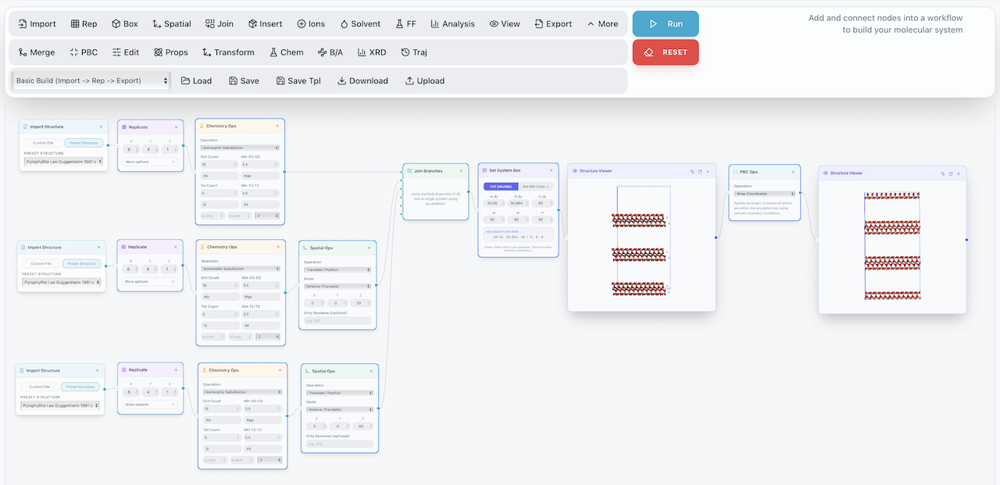

# atomipy web module

A powerful, node-based visual programming environment for designing, manipulating, and analyzing molecular systems. Built on top of the **[atomipy](https://github.com/mholmboe/atomipy)** Python library, this web application allows researchers to create complex mineral-water systems through an intuitive graph interface.

> ⚡ **Run it free in your browser — with a GPU.** Launch the full app on **Google Colab** with free NVIDIA GPU acceleration for molecular dynamics — no install and no account needed: [](https://colab.research.google.com/github/mholmboe/atomipy-web-module/blob/main/ColabLaunchGuide.ipynb) &nbsp;(see [GPU-Accelerated Google Colab Access](#-gpu-accelerated-google-colab-access-recommended-for-simulations) below).



## 🚀 Key Features

- **Interactive MD & Energy Minimization (EM) Simulations**:
    - **Simulation Node**: Execute Molecular Dynamics (NVT/NPT) and Energy Minimization (EM) simulations directly in the node workspace.
    - **Dynamic EM Trajectories**: Unlike standard minimizers, EM now runs step-by-step to compile a smooth, real-time relaxation trajectory of your system.
    - **Max Force Norm Logging**: EM table outputs report both Potential Energy and Maximum Euclidean Force Norm vectors in standard `kJ/mol/nm` units.
    - **Decoupled reporting frequencies**: Configure **Log frequency (steps)** and **PDB frequency (steps)** independently in the advanced settings.
    - **Clean Log CSV Headers Interceptor**: Built-in Python output stream wrapper (`CleanHeaderStream`) automatically filters and cleans comment symbols (`#`) and double quotes (`"`) from CSV header columns.
    - **GPU Acceleration**: Utilizes hardware GPU acceleration (via OpenMM's OpenCL/Metal/CUDA platforms) automatically when available, falling back to CPU or Reference platforms seamlessly.
    - **Live Trajectory Plotting**: Real-time graphing of potential energy and temperature progress directly in the web UI.
    - **Auto-Unzipping & Download**: Download the completed trajectory, topology, and state files in an automatically unzipped structural bundle.
- **Visual Workflow**: Build systems by connecting nodes: Import → Replicate → Solvate → Add Ions → Run Simulation → Export.
- **Structure Uploads**: Drag-and-drop structural coordinate files (`.pdb`, `.gro`, `.xyz`, `.cif`/`.mmcif`, `.pqr`, `.poscar`, `.cjson`) cleanly into both the Import and Insert nodes.
- **Fluctuating Bounding Box Rendering**: Enabled dynamic unit cell/box animation in the 3Dmol viewer. Supports NPT simulation box expansion and contraction playbacks up to **1000 frames**.
- **Top-Left Warnings Position**: Floating Workflow Warning banners are positioned in the top-left corner of the editor canvas to prevent bottom dock overlapping.
- **Undo & Redo Capabilities**: Unlimited layout timeline history (up to 50 snapshots) with full `Cmd+Z` / `Cmd+Y` (or `Ctrl+Z` / `Ctrl+Y`) keyboard shortcut integration.
- **Session Auto-save & Restore**: Debounced local storage caching preserves the complete workflow layout across page refreshes or unexpected crashes.
- **Topological Warnings Alert**: Active rule-based prerequisite check validation (e.g. alerts when a Forcefield node is missing before a Simulation).
- **Trajectory Frame Extraction**: Advanced trajectory parser allowing standard pass-through of coordinates and single-frame snapshot extraction.
- **Strict Backend Safety Limits**: Enforced safety boundaries on system sizes and parameters:
    - **Replication Limits**: Maximum grid replication size capped at $15 \times 15 \times 15$.
    - **Spacing Safeguards**: Early errors for non-positive or abnormal solvate/ion minimum distances.
    - **Ion Thresholds**: Capped maximum ionization count at $10,000$ to prevent out-of-memory overheads.
    - **Path Traversal Shields**: Basename-scoped path parsing blocking folder traversal attempts (`..` or absolute prefixes).
- **Structure Libraries**: Built-in MINFF mineral presets, a ~517-CIF inorganic crystal library (Avogadro), and a ~428-molecule organic library (amino acids, nucleobases, sugars, …).
- **3D Visualization**: Real-time 3D previewing with integrated **3Dmol.js / JSmol** viewers (PNG export, JSmol measurements).
- **Forcefield Generation**: Inorganic **MINFF / CLAYFF** and a frozen **Dummy FF** for non-MINFF materials; organic **GAFF** and **OpenFF (Sage/Parsley)**.
- **Advanced Analysis**:
    - **XRD Patterns**: Simulate high-performance X-ray diffraction patterns.
    - **BVS/GII Analysis**: Calculate Bond Valence Sums and Global Instability Index.
    - **Solvation & Ionization**: Automated placement of water and ions with periodic boundary awareness.
- **Format Support**: Import/Export for PDB, GRO, XYZ, and CIF (with symmetry expansion).

---

## 🧬 Building Multi-Component Systems (multiple minerals &/or organics)

You can combine **several different minerals** (e.g. pyrophyllite + kaolinite) and/or
**several different organic molecules** (e.g. methanol + ethanol) in one simulation.
The rule is simple: **each distinct component is its own branch, joined with an `Add` node.**

### Topology

```
Mineral A  → Forcefield (MINFF/CLAYFF) ─┐
Mineral B  → Forcefield (MINFF/CLAYFF) ─┤
Organic A  → Forcefield (GAFF/OpenFF)  ─┼──► Add (Join) ──► Ions / Solvent ──► Simulate / Export
Organic B  → Forcefield (GAFF/OpenFF)  ─┘
```

- **One Forcefield node per component** (mineral or organic).
- **One OpenFF/ACPYPE call per organic branch** — you cannot parametrize two molecules
  on a single branch. Two organics = two branches. (Each organic branch is
  `Structure (SMILES/file) → … → Forcefield (organic)`.)
- Feed every branch into a single **Add** node, then continue to Ions, Solvent,
  Simulate, or Export.

### Molecule naming (automatic — no setup needed)

Each component is given a **unique GROMACS `[ moleculetype ]`/residue name** so the merged
`.top` is valid (no duplicate or dangling molecule types):

- **Minerals**: `MIN`, `MIN_1`, `MIN_2`, …
- **Organics**: a single organic stays `organic`; multiple become `organic_1`, `organic_2`, …

They appear in the final `[ molecules ]` section, e.g.:

```
[ molecules ]
MIN        1
MIN_1      1
organic_1  180
organic_2  90
SOL        2000
Na         6
Cl         6
```

### Optionally name your components

Each **Forcefield** node has an optional **"Molecule name"** field (on both the Inorganic
and Organic tabs). Set it to give a component a meaningful name — `PYRO`, `KAOL`, `MeOH`,
`EtOH` — instead of the auto name. The value becomes the `[ moleculetype ]`/residue name.

### Good to know

- **Topology wins over the structure file.** GROMACS/OpenMM trust the `.top`
  `[ molecules ]` section over residue names in the `.gro`/`.pdb`. The optional
  **Topology** node lets you review the detected `[ molecules ]` after a run and
  override it (name + count) directly.
- **Counts:** replicated copies (e.g. `organic_1 180`) are set on the **Replicate** node;
  an *exact* water count is set on the **Solvent** node → *More options → Max Molecules →
  Fixed count*.

---

## 🧊 Dummy FF — simulating inorganics not covered by the built-in force fields

The built-in force fields (MINFF / CLAYFF) only type a specific element set
(Si, Al, Mg, Fe, Ca, Ti, Li, F, O, H). For a material containing anything else —
**Mn, Ni, Co, Cu, Zn, As, Ag, Pb, …** (e.g. MnO, NiO, Cr₂O₃) — pick
**Forcefield → Dummy FF**. It builds a *qualitative* model so the material can
still interact with water and solutes:

- **Charges** — `Pauling effective` (default): each cation gets `q_eff =
  oxidation × [1 − exp(−¼(χ_O − χ_M)²)]` (its bond's ionic character), H = +0.4,
  and oxygens take a coordination-resolved charge so each framework is neutral.
  A simpler `Half oxidation state` mode is also available.
- **Lennard-Jones** — borrowed: oxygen → OPC3 water-O, fluorine → F⁻, hydrogens
  none. Metals use a small buried site (default `Alo`) inside oxides/halides;
  for a **pure metal/alloy** each metal gets **element-appropriate LJ** (Heinz
  2008 for fcc Cu/Ag/Au/Ni/Pd/Pt/Al/Pb; UFF for others).
- **Frozen framework** — the lattice atoms are frozen (mass 0), so **no bonded
  parameters are needed**. They hold their positions while water, ions and
  organics move and interact with them electrostatically.

**How to use it**
1. Load your structure (preset or upload). On the **inorganic** tab, click
   *Preview & Validate* — it scans the elements and, if any aren't covered by the
   built-in force fields, tells you to use the Dummy FF.
2. Set the **Forcefield** node to **Dummy FF** (optionally choose the charge
   model and metal LJ site).
3. Add Solvent / ions as usual and run **Energy Minimization or NVT** (NPT is
   blocked — a frozen rigid body can't be barostatted).

Mixed systems work: **multiple dummy minerals**, **several different organics**,
water and ions can all coexist in one frozen-framework run. This is for
qualitative questions (wetting, ion adsorption, interfacial structuring) — not
quantitative energetics.

---

## 🛠️ Getting Started

> 📖 For the full installation & deployment reference (local / online / Colab
> differences, build triggers, env vars), see **[DEPLOYMENT.md](DEPLOYMENT.md)**.

### Online Access
Use the hosted version directly at:  
👉 **[www.atomipy.io](https://www.atomipy.io)** (also mirrored at [atomipy.io](https://atomipy.io) and [top.atomipy.io](https://top.atomipy.io))

The hosted site is **CPU-only** and runs **Energy Minimization** only
(`SIMULATION_MODE=em_only`). **NVT/NPT MD is not available there** — the app
recommends running it on the **GPU-accelerated Google Colab** launch below (or a
local install).

> **Simulation workflow tip:** always chain an **Energy Minimization (EM)** node
> *before* an **NVT / NPT** node. Running NVT/NPT directly on a freshly built or
> solvated structure can diverge (`Particle coordinate is NaN`) on the CPU
> platform — EM relaxes the starting structure first.

> **Results & data retention:** results can only be downloaded right after they
> are generated. Nothing is stored on the server — there is no database or
> persistent storage — so results cannot be retrieved later. Always download and
> keep your own local copy.

---

### ⚡ GPU-Accelerated Google Colab Access (Recommended for Simulations)
[](https://colab.research.google.com/github/mholmboe/atomipy-web-module/blob/main/ColabLaunchGuide.ipynb)

If you plan to run large molecular dynamics simulations, you can launch the Visual Builder with **free hardware GPU acceleration** via Google Colab!
1. Click the **"Open in Colab"** badge above to load the notebook directly in Google Colab.
2. Set **Runtime → Change runtime type → GPU**, then run the two cells.

The notebook clones the repo, installs the Python deps + builds the frontend,
and launches the **FastAPI server** (which serves both the UI and the API) with
**simulations enabled on the GPU**, exposed through a free **Cloudflare Quick Tunnel** (a `*.trycloudflare.com` link — no account, login, or password).

> **Note:** the **Organic Molecule (GAFF/OpenFF)** node needs the separate
> OpenFF worker. It's **off by default** on Colab; run the optional **Step 1b**
> cell in the notebook to install the OpenFF/ACPYPE stack (via micromamba, no
> kernel restart) and start the worker. Everything else (build, forcefields,
> analysis, EM, GPU MD) works without it.

---

### Local Installation

There are two ways to run locally. Both clone the repo first:

```bash
git clone https://github.com/mholmboe/atomipy-web-module.git
cd atomipy-web-module
```

Local simulations use whatever OpenMM platform is available on your machine
(CUDA / Metal / OpenCL GPU if present, otherwise CPU).

#### Option A — Development (hot reload)
Best for development. Requires **Node.js (v20+)**, **Miniconda / Anaconda** (or
mamba), and **redis-server** (`brew install redis` / `sudo apt install redis-server`).

```bash
npm install
./restart_dev.sh
```

`restart_dev.sh` creates the two conda environments (`atomipy-core`,
`atomipy-openff`), starts Redis + the Celery worker, the **Core Backend** (FastAPI,
:8000), the **OpenFF worker** (:8001), and the **Vite** dev server (:8080).
Logs stream to `.dev-logs/`; open <http://localhost:8080>.

#### Option B — Production-like (Docker)
Runs the same single image deployed online (FastAPI serving the built frontend +
API) plus the optional OpenFF worker. Requires only **Docker**.

```bash
docker compose up --build
# open http://localhost:8080
```

Set `DISABLE_SIMULATION=true` in `docker-compose.yml` to disable simulations.

---

## 🐳 Docker & Cloud Run Deployment

> 📖 Full details — build/deploy triggers, the local vs online vs Colab
> differences, env vars, and a repo map — are in **[DEPLOYMENT.md](DEPLOYMENT.md)**.

The app deploys as **two services**:

1. **Main app** (root [`Dockerfile`](Dockerfile)) — one image where the FastAPI
   core backend serves both the API and the built React frontend. Listens on
   `$PORT`.
2. **OpenFF worker** (optional, [`docker/Dockerfile.openff`](docker/Dockerfile.openff))
   — small-molecule GAFF/OpenFF parametrization (the Organic Molecule node).
   The main app reaches it via the `OPENFF_WORKER_URL` env var.

Build/run the main image directly:

```bash
docker build -t atomipy-web .
docker run -p 8080:8080 -e PORT=8080 atomipy-web
```

Key environment variables (main app):

| Variable | Default | Purpose |
|---|---|---|
| `PORT` | `8080` | Port to listen on (Cloud Run injects this) |
| `SIMULATION_MODE` | `full` | `full` · `em_only` (EM only, NVT/NPT → Colab/local) · `disabled` |
| `DISABLE_SIMULATION` | `false` | Legacy: `true` = `disabled` (ignored if `SIMULATION_MODE` set) |
| `OPENFF_WORKER_URL` | `http://127.0.0.1:8001` | URL of the OpenFF worker |
| `WEB_CONCURRENCY` | `1` | uvicorn worker processes |

### Reference deployment (atomipy.io)
A Cloud Run **source-deploy trigger** on this GitHub repo auto-builds the root
`Dockerfile` and deploys to the `atomipy-web-module` service on **every push to
`main`** (project `atomipywebmodule`, region `europe-north1`; domains atomipy.io /
www / top map to it), with `DISABLE_SIMULATION=false`, `OPENFF_WORKER_URL` set,
and **4Gi** memory. The image ships **no OpenCL driver**, so OpenMM uses the
native CPU platform online.

> The OpenFF worker has **no auto-trigger** — redeploy it manually after changing
> `workers/`, `envs/atomipy-openff.yml`, or `docker/Dockerfile.openff`:
> `gcloud builds submit --config cloudbuild.openff.yaml`.

### Deploy your own on Cloud Run
```bash
# 0. One-time: enable APIs + an Artifact Registry repo
gcloud services enable run.googleapis.com cloudbuild.googleapis.com artifactregistry.googleapis.com
gcloud artifacts repositories create atomipy --repository-format=docker --location=REGION

# 1. OpenFF worker (≥2Gi RAM — importing openff toolkit alone OOMs 512Mi).
#    Must stay public: the main app calls it without an auth token.
gcloud builds submit --config cloudbuild.openff.yaml   # builds + deploys the worker

# 2. Main app (serves frontend + API + CPU sims)
gcloud run deploy atomipy-web-module --source . --region REGION \
  --allow-unauthenticated --memory 4Gi --cpu 2 --timeout 900 \
  --set-env-vars DISABLE_SIMULATION=false,OPENFF_WORKER_URL=<worker-url>

# 3. (optional) Wire continuous deploys: Cloud Run console → "Set up continuous
#    deployment" on the GitHub repo, or use cloudbuild.yaml as a build trigger.
```

Notes:
- The main app needs **≥2Gi** (4Gi recommended) — `/tmp` is RAM-backed on Cloud
  Run and build outputs are written there.
- [`cloudbuild.yaml`](cloudbuild.yaml) / [`cloudbuild.openff.yaml`](cloudbuild.openff.yaml)
  are declarative build/deploy configs (used by `gcloud builds submit`, or wire
  them to a trigger). See the headers in those files.

---

## 🏗️ Architecture

- **Frontend**: React, React Flow (for the node graph), Tailwind CSS, Shadcn UI — built with Vite and served by the backend in production.
- **Core Backend**: FastAPI (Python), serving the frontend, build-stream execution, and native `atomipy` merging logic without heavy GMSO dependencies.
- **OpenFF Worker**: Isolated FastAPI microservice handling `openff-interchange` / `openff-toolkit` (GAFF/Sage), reached via `OPENFF_WORKER_URL`.
- **Task Queue (optional)**: Celery + Redis for asynchronous jobs; not required for the build-only online path.
- **Core Engine**: `atomipy` (molecular geometry & purely native dictionary-based topology merging).
- **Legacy**: `app.py` (Flask) predates the FastAPI unification and is no longer in the serving path.

## 📄 License
This project is part of the atomipy web module toolbox. See the main [atomipy](https://github.com/mholmboe/atomipy) repository for licensing details.
